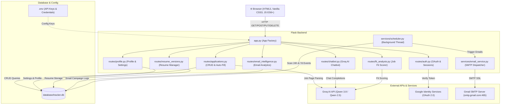

<div align="center">

# 💼 Job & Internship Application Tracker


---

**A full-stack, enterprise-grade job application tracker with AI-powered auto-fill, floating career assistant chatbot, smart calendar, real-time analytics, automated 24-hour email reminders, Google One Tap OAuth 2.0, resume version tracking, email intelligence analysis, and multi-tabbed profile & settings management.**

[🚀 Features](#-features) • [🏗️ Architecture](#️-architecture) • [🗄️ Database Schema](#️-database-schema) • [🔌 API Reference](#-api-reference) • [⚙️ Setup Guide](#️-setup-guide) • [🧪 Tests](#-test-suite)

</div>

---

## 📌 Problem Statement

Job seekers and students applying for tech roles face critical bottlenecks:

| Pain Point | Impact |
|-----------|--------|
| 📋 **Scattered Data** | Applications across spreadsheets, emails, and browser tabs → lost follow-ups |
| ⏰ **Missed Deadlines** | No automated 24-hour advance warnings for interviews and assessments |
| ✍️ **Manual Data Entry** | Typing company name, job title, location, and salary for 50+ job links is exhausting |
| 🤷 **No Interview Prep** | Lack of instant AI-driven guidance tailored to target company and role |
| 📄 **Resume Chaos** | No version tracking across multiple customized resume editions |
| 📧 **Email Blindspot** | No way to analyze which email outreach strategies are working |

**This tracker solves all of the above in a single, unified platform.**

---

## 🚀 Features

### 🤖 1. Groq AI Auto-Fill & Career Assistant Chatbot
- **URL Auto-Fill**: Paste any LinkedIn, Greenhouse, Lever, Workday, or company career page URL → Groq AI (`qwen/qwen3.8-27b`) extracts Company Name, Job Title, Location, Job Type, and Salary in under 2 seconds.
- **Floating AI Career Assistant Chatbot**:
  - Available across all views via a persistent floating drawer widget.
  - Pre-built quick-prompt pills: *Interview Prep*, *Resume Advice*, *Follow-up Email Drafting*, *Application Summary*.
  - Powered by Groq AI with automatic Markdown rendering.

---

### 📅 2. Smart Calendar View (`/view-calendar`)
- **Interactive Monthly Grid**: Displays all interviews, assessments, follow-ups, and deadlines.
- **Color-Coded Event Pills**:
  - 🟣 **Interviews** — Purple
  - 🟡 **Follow-ups** — Amber
  - 🔵 **Assessments** — Blue
  - 🔴 **Deadlines** — Red
- **Interactive Pulse-Glow Navigation**: Clicking any event pill scrolls to and highlights the exact Kanban card.

---

### 📈 3. Analytics & Performance Dashboard (`/view-analytics`)
- **KPI Metric Cards**: Total Applications, Interview Rate (%), Offer Rate (%), Rejection Rate (%)
- **Status Funnel Breakdown**: Animated horizontal progress bars for `Applied → Interviewing → Offered`
- **SVG Donut Ring Chart**: Dynamic status proportion visualization
- **Powered by**: `GET /api/analytics`

---

### ⏰ 4. Automated Email Reminders (24-Hour & 7-Day)
- **24-Hour Interview/Assessment Alerts**: Background daemon thread scans the database and dispatches Gmail SMTP emails exactly 24 hours before any scheduled event.
- **7-Day Stale Application Follow-Ups**: Applications untouched for 7+ days trigger automated follow-up email reminders.
- **Anti-Spam Safeguards**: `last_interview_reminder_sent`, `last_assessment_reminder_sent`, `last_email_sent` fields ensure each user receives **at most one email per event**.

---

### 📄 5. Resume Version Manager
- **Upload & Store Multiple Resume Versions**: Track `v1-general.pdf`, `v2-amazon.pdf`, etc.
- **Tagging System**: Label each version with target role or company.
- **Link to Applications**: Associate specific resume versions with specific job applications.
- **Powered by**: `routes/resume_versions.py` + `pypdf` + `python-docx`

---

### 📧 6. Email Intelligence Analyzer
- **Outreach Campaign Tracking**: Log cold emails, recruiter contacts, and follow-up messages.
- **Reply Rate Analysis**: Track which subject lines, email bodies, and timing strategies yield responses.
- **Insights Dashboard**: AI-powered suggestions on improving email outreach effectiveness.
- **Powered by**: `routes/email_intelligence.py` (30KB feature module)

---

### 🎯 7. AI Job Fit Analyzer
- **Resume vs. Job Description Matching**: Upload your resume and paste a JD → get a compatibility fit score.
- **Gap Analysis**: Identifies missing skills and keywords.
- **Tailored Suggestions**: AI recommendations for resume improvements targeted to the specific role.
- **Powered by**: `routes/fit_analysis.py` + Groq AI

---

### 📋 8. 4-Column Kanban Board
- **Status Columns**: `Applied` → `Interviewing` → `Offered` → `Rejected`
- **Drag-and-Drop Status Update**: Move cards with instant database sync
- **Inline Status Dropdown**: Change status directly on the card
- **Stale Alert Badges**: Amber warning on cards untouched 7+ days
- **Instant Search Bar**: Live filter by company name or job title

---

### 👤 9. Profile Information Management (`/view-profile`)
- Live avatar preview (URL or initials monogram)
- Personal details: Name, Email, Phone, Location
- Academic background: University, Graduation Year, Professional Headline

---

### ⚙️ 10. System Settings (`/view-settings`)
| Tab | Features |
|-----|---------|
| **Notifications** | Toggle follow-up/interview reminders, reminder timing (1 Day / 2 Hours / Morning of), email notifications |
| **Appearance** | Theme (Light/Dark/Auto), Dashboard view (Kanban/List), Card density (Compact/Comfortable/Spacious) |
| **Account & Security** | Change password, Active sessions, Logout all devices, Account deletion |

---

### 🔑 11. Authentication
- **Google One Tap OAuth 2.0**: Single-click sign-in via `routes/auth.py`
- **Standard Auth**: Email/password with Werkzeug `generate_password_hash` / `check_password_hash`
- **Multi-User Data Isolation**: All queries enforce `WHERE user_id = ?`

---

## 🏗️ Architecture



---

## 🗄️ Database Schema

```mermaid
erDiagram
    USERS ||--o{ APPLICATIONS : owns
    USERS ||--o| USER_SETTINGS : configures
    USERS ||--o{ RESUME_VERSIONS : uploads
    USERS ||--o{ EMAIL_CAMPAIGNS : tracks
    
    USERS {
        int id PK
        string username UK
        string email UK
        string password_hash
        string google_id UK
        string avatar_url
        string full_name
        string phone
        string location
        string headline
        string university
        string grad_year
        timestamp created_at
    }

    USER_SETTINGS {
        int user_id PK_FK
        int notify_followup
        int notify_interview
        string reminder_time
        int email_notifications
        string theme
        string dashboard_view
        string card_density
        int show_stats
        int show_warnings
        int show_interview_dates
    }

    APPLICATIONS {
        int id PK
        int user_id FK
        string company_name
        string job_title
        string status
        date date_applied
        date last_updated
        text notes
        date last_email_sent
        date interview_date
        date deadline_date
        date assessment_date
        date followup_date
        string job_url
        string salary
        string location
        string job_type
        date last_interview_reminder_sent
        date last_assessment_reminder_sent
    }

    RESUME_VERSIONS {
        int id PK
        int user_id FK
        string filename
        string label
        string target_role
        blob file_data
        timestamp uploaded_at
    }

    EMAIL_CAMPAIGNS {
        int id PK
        int user_id FK
        string recipient
        string subject
        string body_preview
        string status
        int replied
        timestamp sent_at
    }
```

---

## 📁 Project Structure

```
Job_Application_Tracker/
├── app.py                          # Flask app factory & blueprint registration
├── config.py                       # Configuration loader (env vars & defaults)
├── .env.example                    # Credential template (copy to .env)
├── requirements.txt                # Python dependencies
├── vercel.json                     # Vercel serverless deployment config
│
├── database/
│   ├── db.py                       # SQLite connection & auto-migration engine
│   └── schema.sql                  # SQL schema definitions
│
├── routes/
│   ├── __init__.py
│   ├── applications.py             # Applications CRUD, Auto-Fill, Analytics, Calendar APIs (49KB)
│   ├── auth.py                     # Login, Register, Google OAuth 2.0
│   ├── chatbot.py                  # Groq AI Career Assistant Chatbot API
│   ├── profile.py                  # Profile & Settings GET/PUT endpoints
│   ├── resume_versions.py          # Resume version upload, list, delete
│   ├── email_intelligence.py       # Email campaign tracking & analytics (30KB)
│   └── fit_analysis.py             # AI Job Fit Scoring & Gap Analysis
│
├── services/
│   ├── email_service.py            # Gmail SMTP dispatcher (HTML email templates)
│   └── scheduler.py               # Background daemon thread for email automation
│
├── components/                     # Reusable UI component templates
│
├── static/
│   ├── css/style.css               # Glassmorphism dark theme CSS
│   └── js/app.js                   # Vanilla JS: Kanban, search, calendar, analytics
│
├── templates/
│   ├── base.html                   # Base layout, header, nav buttons
│   ├── dashboard.html              # Main Kanban board & modals
│   ├── login.html / signup.html    # Auth pages (split-screen design)
│   ├── welcome.html                # Public landing/marketing page
│   └── partials/
│       ├── _application_card.html          # Job application card component
│       └── _upcoming_interview_card.html   # Interview widget component
│
└── tests/
    ├── test_routes.py              # Core CRUD & API route tests
    ├── test_profile_settings.py    # Profile & settings endpoint tests
    ├── test_event_reminders.py     # Email reminder logic tests
    └── test_chatbot.py             # AI chatbot endpoint tests
```

---

## 🔌 API Reference

| Method | Endpoint | Description | Auth |
|--------|----------|-------------|------|
| `GET` | `/welcome` | Public landing/marketing page | ❌ |
| `GET` | `/` | Main dashboard (Kanban board) | ✅ |
| `POST` | `/signup` | User registration | ❌ |
| `POST` | `/login` | User login | ❌ |
| `POST` | `/auth/google` | Google One Tap OAuth 2.0 | ❌ |
| `GET` | `/applications` | Fetch all user job applications | ✅ |
| `POST` | `/applications` | Create new application entry | ✅ |
| `PUT` | `/applications/<id>` | Update application fields/status | ✅ |
| `DELETE` | `/applications/<id>` | Delete application entry | ✅ |
| `POST` | `/api/autofill-url` | Extract job details from URL via Groq AI | ✅ |
| `POST` | `/api/chatbot/chat` | Groq AI Career Assistant completions | ✅ |
| `GET` | `/api/calendar-events` | Fetch structured calendar events | ✅ |
| `GET` | `/api/analytics` | KPI metrics & funnel statistics | ✅ |
| `GET/PUT` | `/api/profile` | Retrieve/update user profile | ✅ |
| `GET/PUT` | `/api/settings` | Retrieve/update system preferences | ✅ |
| `POST` | `/api/account/change-password` | Update account password | ✅ |
| `POST` | `/api/account/delete` | Permanently delete account & data | ✅ |
| `GET/POST` | `/api/resume-versions` | List/upload resume versions | ✅ |
| `DELETE` | `/api/resume-versions/<id>` | Delete resume version | ✅ |
| `GET/POST` | `/api/email-intelligence` | Email campaign tracking & analytics | ✅ |
| `POST` | `/api/fit-analysis` | AI resume vs JD fit scoring | ✅ |

---

## ⚙️ Setup Guide

### Prerequisites
- Python 3.10+
- A [Groq API key](https://console.groq.com/) (free tier available)
- A Gmail account with [App Password](https://myaccount.google.com/apppasswords) enabled
- A [Google Cloud Console](https://console.cloud.google.com/) OAuth 2.0 Client ID

### 1. Clone & Virtual Environment

```bash
git clone https://github.com/Mohansabariraja/JOB-Tracker-.git
cd JOB-Tracker-

python -m venv venv
venv\Scripts\activate        # Windows
# source venv/bin/activate   # macOS/Linux

pip install -r requirements.txt
```

### 2. Configure Environment Variables

Create a `.env` file in the project root (use `.env.example` as a template):

```env
SECRET_KEY=your-super-secret-flask-key

# Google OAuth 2.0
GOOGLE_CLIENT_ID=your_client_id.apps.googleusercontent.com

# Gmail SMTP (use App Password, NOT your main password)
MAIL_SERVER=smtp.gmail.com
MAIL_PORT=465
MAIL_USERNAME=your_gmail@gmail.com
MAIL_PASSWORD=your_16_character_app_password

# Groq AI
GROQ_API_KEY=gsk_your_groq_api_key
GROQ_MODEL=qwen/qwen3.8-27b

# Optional
DEBUG=True
```

### 3. Run the Application

```bash
python app.py
```

Open **`http://127.0.0.1:5000`** in your browser.

### 4. Deploy to Vercel (Optional)

```bash
npm i -g vercel
vercel --prod
```

The `vercel.json` is pre-configured for Python Flask serverless deployment.

---

## 🧪 Test Suite

```bash
pytest
```

**21 automated unit tests** across 4 test modules:

| Test File | Coverage |
|-----------|----------|
| `tests/test_routes.py` | Core CRUD routes, auth, applications |
| `tests/test_profile_settings.py` | Profile & settings endpoints |
| `tests/test_event_reminders.py` | 24h & 7-day email reminder logic |
| `tests/test_chatbot.py` | AI chatbot API endpoint |

---

## 🛠️ Tech Stack

| Layer | Technology |
|-------|-----------|
| **Backend** | Python 3.10+, Flask 3.0 |
| **Database** | SQLite (auto-migrating schema) |
| **AI / ML** | Groq AI API — `qwen/qwen3.8-27b`, `qwen/qwen2.5` |
| **Authentication** | Google Identity Services OAuth 2.0, Werkzeug password hashing |
| **Email** | Gmail SMTP (SSL/TLS port 465), Python `smtplib` |
| **Scheduling** | Python `threading.Thread` background daemon |
| **Resume Parsing** | `pypdf`, `python-docx` |
| **Frontend** | Vanilla HTML5, CSS3 (Glassmorphism dark theme), JavaScript ES6+ |
| **Deployment** | Vercel (serverless), local Flask dev server |
| **Testing** | pytest 7+ |

---

## 📺 Demo Checklist

- [x] **Google One Tap Sign-In** or standard email/password login
- [x] **AI URL Auto-Fill**: Paste any LinkedIn/Greenhouse/Lever job URL → instant field population
- [x] **AI Career Chatbot**: Ask for interview tips, resume feedback, or draft a follow-up email
- [x] **Kanban Board**: Create, move, and delete application cards
- [x] **Smart Calendar**: Click any event pill → highlights the corresponding card with pulse animation
- [x] **Analytics Dashboard**: Real-time KPI metrics and donut chart
- [x] **24-Hour Email Reminder**: Set an assessment/interview for tomorrow → receive automated email
- [x] **Resume Version Manager**: Upload and label multiple resume versions
- [x] **Job Fit Analyzer**: Score your resume against any job description
- [x] **Email Intelligence**: Track and analyze outreach campaign effectiveness

---

## 🤝 Contributing

1. Fork the repository
2. Create your feature branch: `git checkout -b feature/amazing-feature`
3. Commit your changes: `git commit -m 'Add amazing feature'`
4. Push to the branch: `git push origin feature/amazing-feature`
5. Open a Pull Request

---

## 📄 License

This project is licensed under the **MIT License** — see the [LICENSE](LICENSE) file for details.

---

<div align="center">

**Built with ❤️ by [Mohansabariraja](https://github.com/Mohansabariraja)**

⭐ **Star this repo if it helped you land your dream job!** ⭐

</div>
